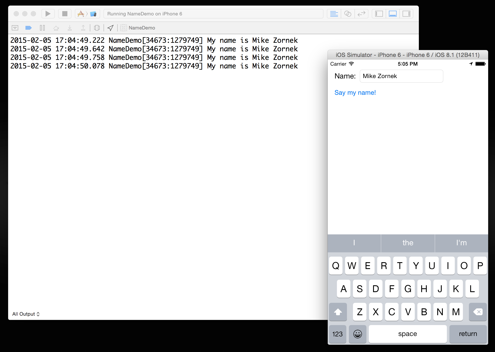
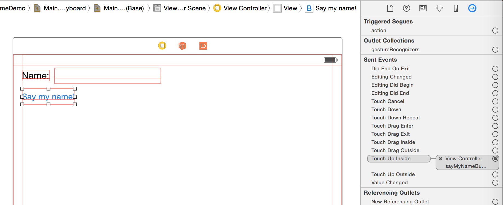
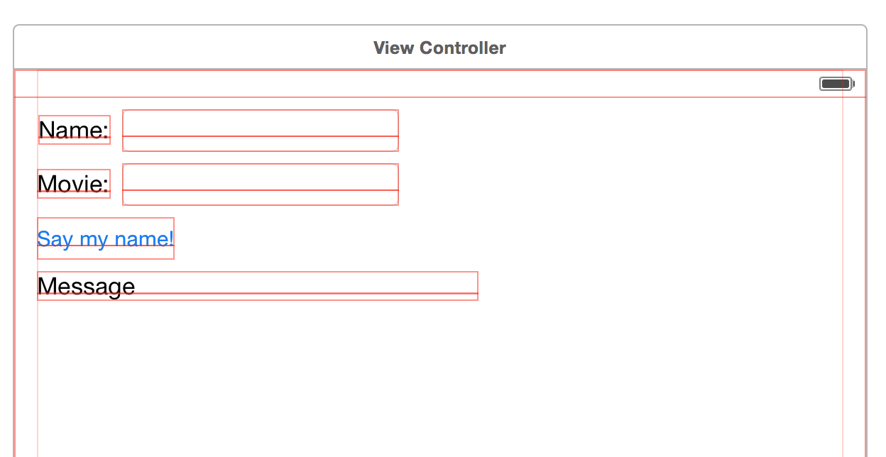

# Model-View-Controller

^ As software grows, so does complexity. One of the goals of MVC is to help provide an abstraction so that we may more easily talk about 100s if not 1000s of objects.

--- 

 

https://developer.apple.com/library/ios/documentation/General/Conceptual/DevPedia-CocoaCore/MVC.html

---

# Models

^ Business Logic
^ ToDoItem
^ Problem State
^ You will build lots of these

--- 

# Views

^ Represent things on screen, subview of views
^ Apple provides most of the ones you'll need

---- 

# Controllers

^ the glue in-between model and view.
^ Usually bigger than they should be. 
^ Can have many small controllers fill out the various behaviors.
^ Apple provides some. You'll subclass and add behavior.
^ You'll also prob write lot of "services" "managers" and "stores".

--- 

 

--- 

# Name Demo

---



^Through this demo we want to showcase

^ Actions and Outlets

---

# Outlets

````swift
class ViewController: UIViewController {
    @IBOutlet weak var nameTextField: UITextField!
}
````

---


 
---


# Actions

--- 

````swift
class ViewController: UIViewController {
    
    @IBAction func sayMyNameButtonAction(sender: AnyObject) {
        ...
    }

}
````

--- 



--- 

#UIViewController

^ When it comes toMVC on iOS Apple will generally provide most of the views and the majority of the controllers. You will typically do all the models and then service/manager style controllers to do things.

^ UIViewController is the base controller you'll interact with 

--- 
# UIViewController Lifecycle Methods

* viewDidLoad
* viewWillAppear
* viewDidAppear
* viewWillDisappear
* viewDidDisappear

---

# Name Demo

---

# Challenge



Bill's favorite movie is Howard the Duck.
