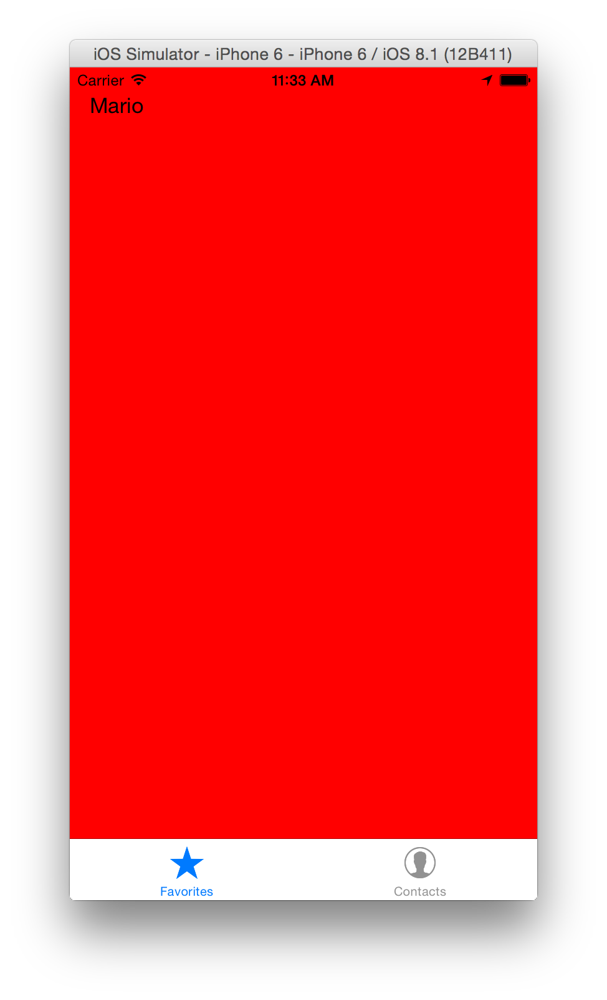
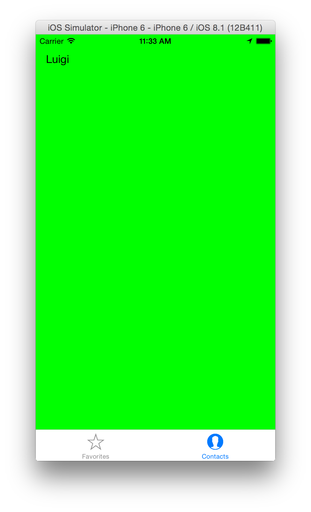
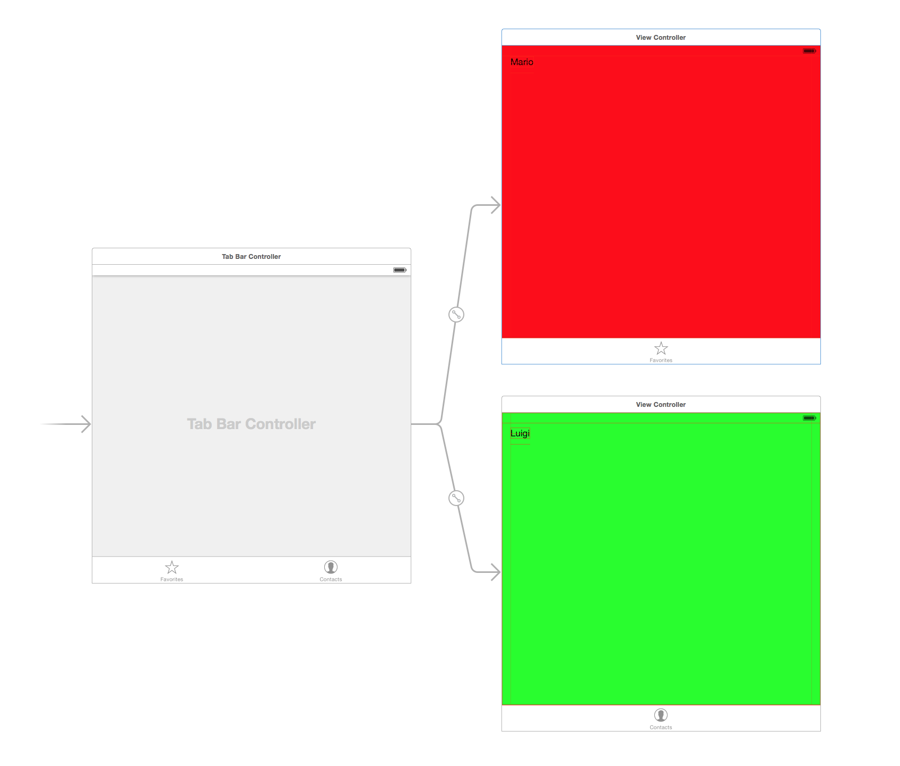
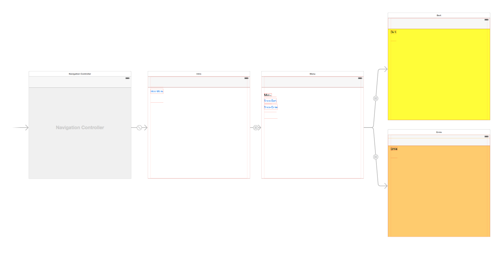
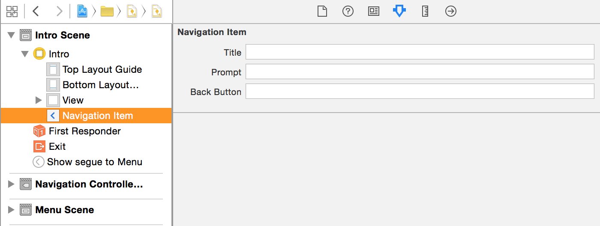

# Modal Presentation

^ Typically animates up from the bottom to cover the full screen.

--- 


---
# Present a Modal

````swift

@IBAction func showBlueVC(sender: AnyObject) {
    
    if let vc = self.storyboard?.instantiateViewControllerWithIdentifier("BlueViewController") 
            as? UIViewController {
        self.presentViewController(vc as UIViewController , animated: true, completion: nil)
    }

}

````

---
# Dismiss a Modal

````swift

@IBAction func dismissAction(sender: AnyObject) {
    self.dismissViewControllerAnimated(true, completion: nil)
}

````

---

# UITabBarController

^ List of view controllers, lets user choose which one to show

---


 

---


---



---

# [fit]UINavigationController

---


---



---



---
# Pushing and Popping in code

^ We'll use Storyboard segues but this is how you push and pop view controllers on the stack.

````swift
func pushViewController(_ viewController: UIViewController, animated animated: Bool)

func popViewControllerAnimated(_ animated: Bool) -> UIViewController?
````

---

# Challenge

In the Navigation Controller sample we just wrote, create a view controller class to back up Bert or Ernie. Add a button to bert or ernie that when tapped jump the navigation controller stack back to the first view controller show.

There is a property on view controller that can help you access the navigationController it is inside. There is also a method on navigation controller that can help you "pop to root".

Don't be afraid to look in the docs.

---