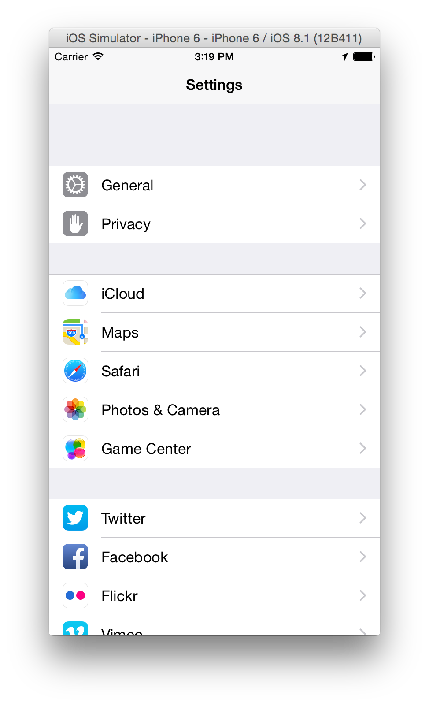
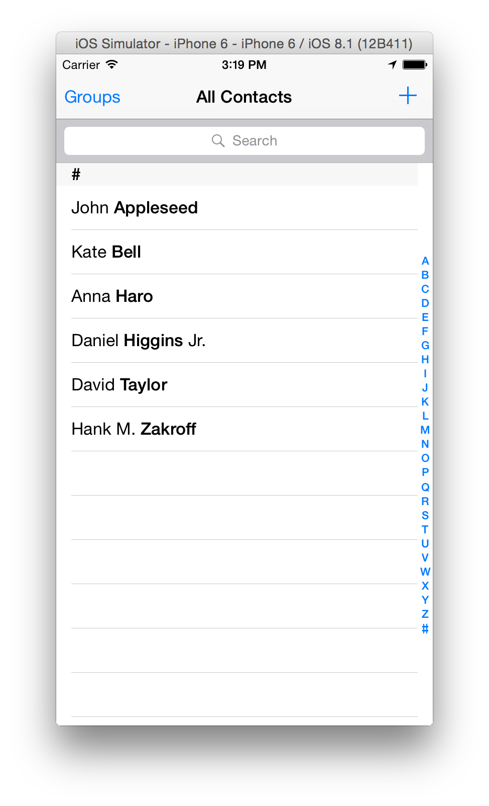

# UITableView

---


 

^ Table View inside of a NavigationController

--- 

# Delegate Pattern

^ used all over the system

^ basic idea is to use delegation to defer configuration or help people get alerted to events

^ UITableView uses both

--- 
# Delegate are executed through Protocols.

Protocols can be thought of as contracts. A list of required methods and a list of optional methods.

^ UITableView has 2 of these delegates

---
# UITableViewDelegate

````swift
func tableView(tableView: UITableView, 
    willSelectRowAtIndexPath indexPath: NSIndexPath) -> NSIndexPath?
````

^ Show docs?

---
# UITableViewDataSource

````swift
func tableView(tableView: UITableView, 
    numberOfRowsInSection section: Int) -> Int 
    
func tableView(tableView: UITableView, 
    cellForRowAtIndexPath indexPath: NSIndexPath) -> UITableViewCell
````

^ a datasource delegate

---

# Cell Design Types


---- 

# Cell Design Types

````swift
init(style style: UITableViewCellStyle, 
    reuseIdentifier reuseIdentifier: String?)

...

UITableViewCell(UITableViewCellStyle.Default, "nameCell")
````

--- 

# Let's Build a ToDoApp!

^ consider demoing from sim

---


