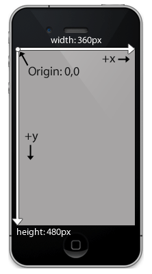
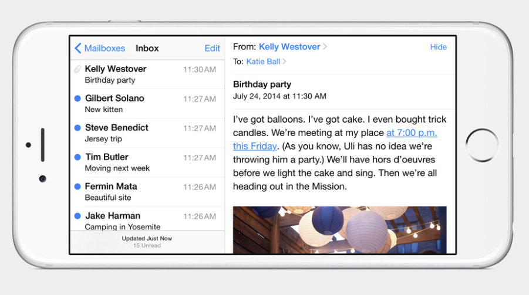
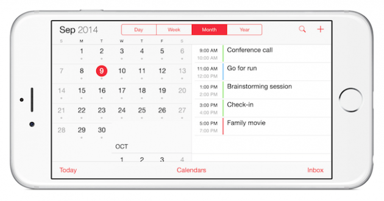

# Auto Layout

^ Like Swift we could do a whole days upon days talking about Auto Layout.

^ There will be a lot of faith to be had reviewing this topic in as short of time as we have.

---

^ At the heart of the positioning system we have a coordinate system

^ starts in upper left and is measure in points, NOT PIXELS

^ before auto layout we'd record our subviews frame, a struct of height/width and position (x, y) and have a basic system of "springs" and "structs" to stretch views when needed

---- 
# What is Auto Layout?

Auto Layout is a system that lets you lay out your app's user interface by creating a mathematical description of the relationships between the elements. You define these relationships in terms of constraints either on individual elements, or between sets of elements.

- Apple's Layout Guide

---

# Advantages

* Way more sophisticated (can accomplish more)
* Really helpful for internationalization / device rotation
* Makes animations more safe/consistent.
* Using w/ Size Classes can help use same UI for iPhone as well as iPad

---

---

---

# Constraints

* Can be built in Interface Builder
* Can be written in code using a "Visual Format Language" 
* Can be built with objects.
* (Also a few third party options)

---
# Intrinsic Size

* Height and Width figured out at layout time
* Content views that have content:
	* UILabel
	* UIImage

---
# Other Thoughts

* No one way to use auto layout
* People new to auto layout tend to over constrain things
* Runtime will remove constraints if needed

^ If you find every time you open the storyboard the view shifts by a point thats a sign you have too many constraints.

---
# Demos